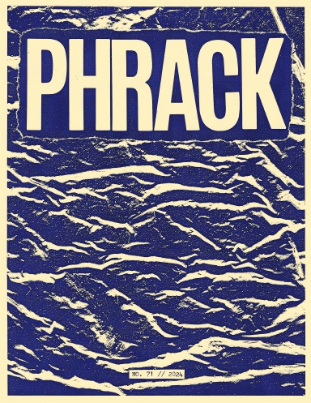
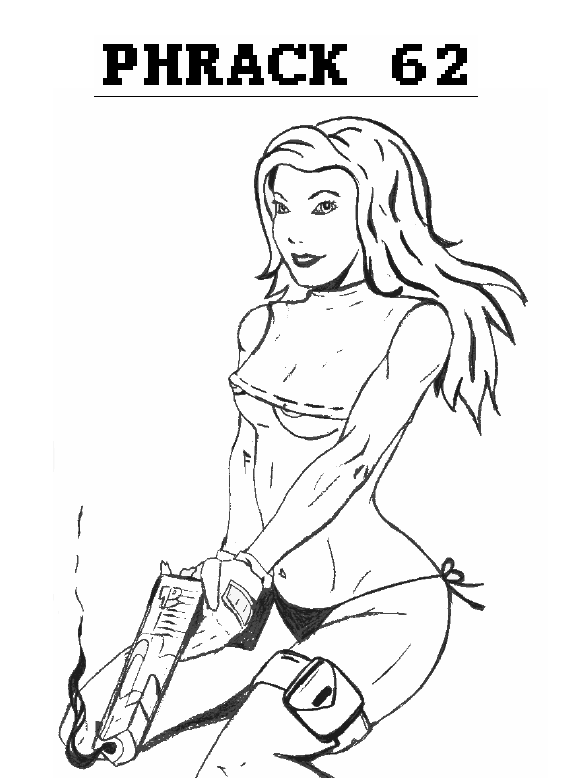

+++
date = '2024-08-20T14:20:34+02:00'
draft = false
title = 'Evasion by De-optimization'
cover = 'cover.png'
categories = ['reverse', 'malware', 'evasion', 'obfuscation']
+++

I recently had the honor of publishing my article on [PHRACK issue 71](https://phrack.org/issues/71/15#article)! This is a very important milestone in my career as a hacker and in my life in general. I always admired the organization and the legendary hackers writing the articles. Instead of re-sharing the article here I have decided to write a little about the history of the Phrack. You can read my article on the [official Phrack website](https://phrack.org/issues/71/15#article). Enjoy ;)

## What is Phrack 

Phrack Magazine is one of the most iconic and influential publications in the hacker and cybersecurity world. It has a long and storied history, tracing back to the early days of digital subculture. Phrack is an electronic magazine (e-zine) focused on topics related to hacking, phreaking (telephone system hacking), computer security, cryptography, and underground culture. It became a cornerstone of the global hacker scene and often combined technical depth with rebellious counterculture ethos. It was founded in November 17, 1985 by Taran King and Knight Lightning (members of the 1980s hacker scene) Phrack originally served as a digital bulletin board zine—distributed via dial-up bulletin board systems (BBSes)—and quickly became one of the most respected sources for information on underground hacking.

Phrack's content has evolved over time, initially focusing on phreaking (telephone hacking) and later expanding to encompass a wider range of topics related to computer security and hacking. The e-zine has been associated with the "Circle of the Lost Hackers" and has been edited under the alias "Phrackstaff". Phrack's influence is widely recognized, with many considering it a foundational publication in the hacking community and a source of knowledge for both hackers and security professionals.

### Fun Fact
The “Smashing the Stack for Fun and Profit” article by Aleph One (Phrack Issue #49, 1996) is one of the most famous articles in computer security history. It introduced many to buffer overflow exploitation.

## Cultural Significance

- Phrack is a time capsule: It mirrors the evolution of hacking culture from analog phone systems to internet-based cyberwarfare.
- Training ground: Many of today’s security experts, penetration testers, and even cybercriminals learned foundational skills from Phrack.
- Hacktivism influence: Phrack's tone and ideology influenced groups like Cult of the Dead Cow, L0pht, Anonymous, and others.

## Legacy

- Phrack still exists and is sporadically updated: https://phrack.org/
- Its archives are often referenced in security research and red team training.
- It’s regarded as one of the few hacker publications to retain technical credibility across decades.
