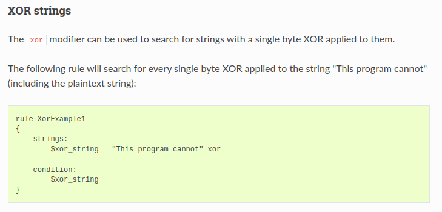
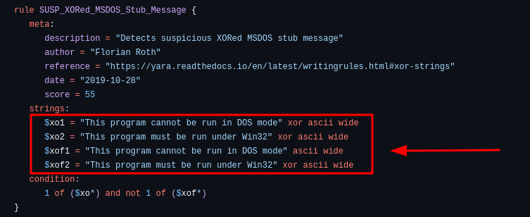
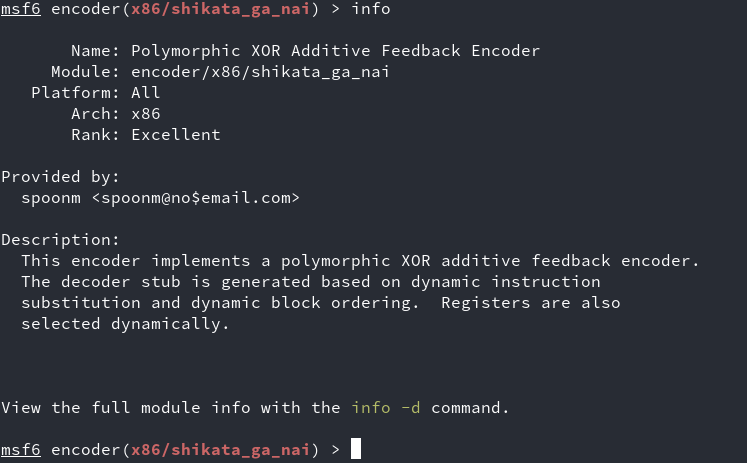
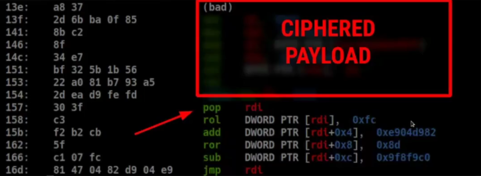
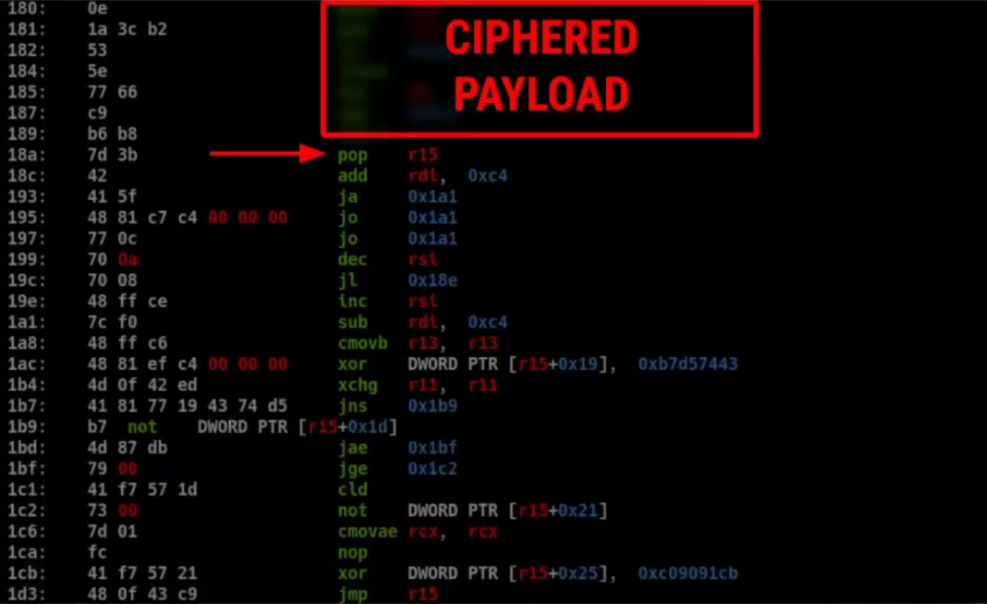
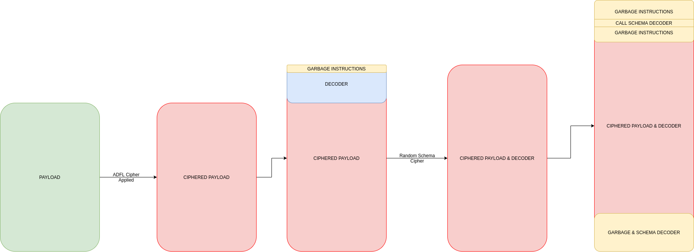
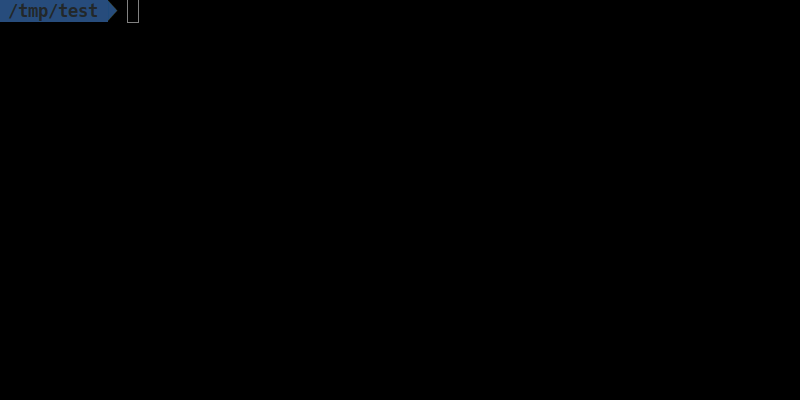
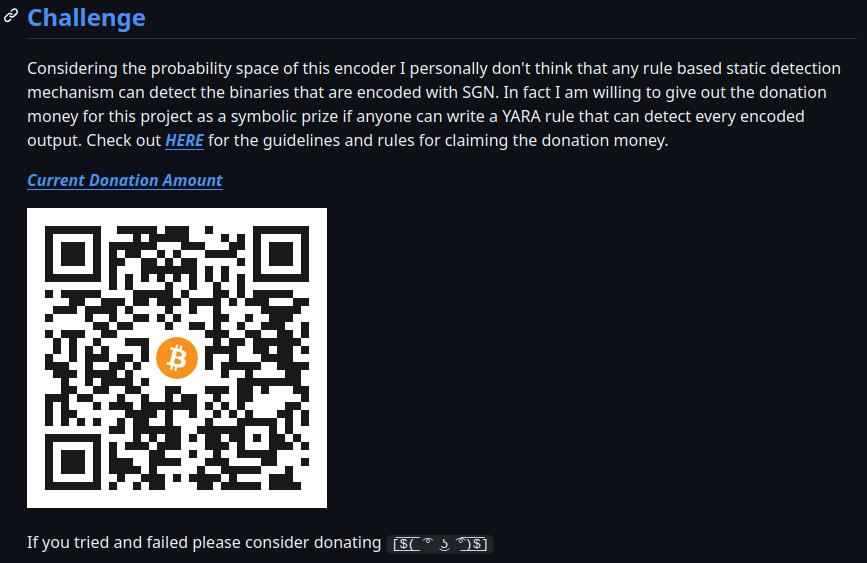

+++
date = '2020-06-07T14:19:33+02:00'
draft = false
title = 'SGN New Generation Polymorphic Encoders'
cover = "cover.jpg"
categories = ['reverse', 'malware', 'evasion', 'obfuscation']
+++

As someone who develops offensive tools for aRed Team, a significant portion of my work involves bypassing security products. This led me to create a new kind of encoder, a tool designed to be a permanent solution for our needs.


## Why Build Another Encoder? My Motivation

The primary goal for this project was clear: design an encoder that is **undetectable by static analysis methods**. This would allow me to focus all my energy on bypassing dynamic analysis techniques. Beyond that, it needed to support character filtering, a crucial feature for transforming attack code to evade detection and handle specific character constraints. Finally, I wanted it to be usable as a Go library, enabling quick and easy integration into other tools I develop. You might be wondering, "Why encoding instead of encryption?" The answer is simple: well-known encryption standards, like AES and RC4, often do more harm than good in offensive security. Their static cryptographic values and algorithmic structures are easily detected by security products, essentially signaling, "Hey, I'm trying to hide something!" Encoding, on the other hand, is a less conspicuous and less "noisy" approach. Furthermore, many popular encoders today are outdated, often a decade old or more, relying on weak cipher methods. They typically use single-key, basic XOR or similar logical operations that are easily detected. In essence, all of them are vulnerable to static detection methods.

## How Current Encoders Work and Why They Fail

An encoder's function is straightforward: take your attack code, transform it using various algorithms, and then attach a decoder stub to restore it when executed. A common example is Metasploit's `call4_dword_xor`. This encoder uses a 4-byte XOR key, looping through the attack code and XORing each section. The decoder then makes a call over the ciphered payload to locates itself in memory (a common shellcoding challenge), and a loop restores the original attack code using the key. **The critical takeaway here is the ubiquitous loop statement in the decoder routine.** 

```rb

def decoder_stub(state)
  # Sanity check that saved_registers doesn't overlap with modified_registers
  if !(modified_registers & saved_registers).empty?
    raise BadGenerateError
  end
  decoder =
    Rex::Arch::X86.sub(-(((state.buf.length - 1) / 4) + 1), Rex::Arch::X86::ECX,
                       state.badchars) +
    "\xe8\xff\xff\xff" + # call $+4
    "\xff\xc0" +         # inc eax
    "\x5e" +             # pop esi
    "\x81\x76\x0eXORK" + # xor [esi + 0xe], xork
    "\x83\xee\xfc" +     # sub esi, -4
    "\xe2\xf4"           # loop xor
  # Calculate the offset to the XOR key
  state.decoder_key_offset = decoder.index('XORK')
  return decoder
end

```

Antivirus and security products heavily rely on detecting these loop conditions. In assembly, loop statements have limited variations. You generally find them using:
* The `loop` instruction
* Load string instructions
* The `rep` instruction (repeating the previous instruction)
* Conditional jumps

Regardless of the specific instruction, they often share common opcode beginnings. This means security products can statically identify the presence of a loop in the assembly output. When they see a loop at the beginning or end of what appears to be "junk" or meaningless code, it immediately raises a red flag.

Another significant issue is the **weak encryption methods** employed by most encoders. Due to the small size constraints of shellcode and decoders, basic logical operations like `ADD`, `SUB`, `AND`, and `OR` are commonly used. However, this simplicity makes the encrypted data easily detectable. For instance, a one-byte XOR key can be instantly identified by tools like Yara. If you're familiar with "known plaintext attacks" in cryptography, you'll understand how simple it is to detect such patterns. Yara's `xor` keyword, for example, can search for all combinations of a string encrypted with a one-byte XOR, making detection trivial.





## A Nod to the Good Ones: Shikata Ga Nai

Despite these shortcomings, there have been some noteworthy efforts in the field. **Shikata Ga Nai**, often considered the best shellcode encoder to date, introduced significant innovations:



* **Polymorphic XOR Additive Feedback Encoder (ADFL):** Similar to Linear Feedback Shift Registers (LFSR), ADFL takes the output of each XOR operation and adds it to the seed, then XORs the next message with that new seed. This means each byte of your encrypted data is XORed with a different value, making it much harder to decipher with known plaintext attacks. It's also relatively simple to implement.
* **Instruction Pointer Retrieval with FNSTENV:** Shikata Ga Nai uses the floating-point instruction `FNSTENV` to push a part of the current context (including the instruction pointer) onto the stack. This allows the decoder to quickly determine its location in memory.
* **Junk Instructions:** This encoder strategically inserts "junk instructions" – operations that do not affect the program's flow (like `xchg eax, ebx` followed by `xchg ebx, eax`). These seemingly meaningless instructions are added to obfuscate the decoder and make it harder for static rules to identify the decoder loop, especially if different junk instructions are used each time.

While innovative, Shikata Ga Nai still has its weaknesses:

* **Visible Decoder Loop:** Even with junk instructions, the decoder's loop remains discernible in the encoded output, still a suspicious indicator for security products.
* **"Shady" Instruction Pointer Retrieval:** The use of the `FNSTENV` floating-point instruction is quite unusual and can draw unwanted attention.
* **No 64-bit Support:** A significant limitation in modern environments.

Recent research [published by Google (FireEye)](https://cloud.google.com/blog/topics/threat-intelligence/shikata-ga-nai-encoder-still-going-strong), has even detailed how to detect these weaknesses with static rules, leading to the creation of Yara rules specifically targeting Shikata Ga Nai.

```yara 
rule Hunting_Rule_ShikataGaNai
{
    meta:
        author = "Steven Miller"
    strings:
        $varInitializeAndXorCondition1_XorEAX = { B8 ?? ?? ?? ?? [0-30] D9 74 24 F4 [0-10] ( 59 | 5A | 5B | 5C | 5D | 5E | 5F ) [0-50] 31 ( 40 | 41 | 42 | 43 | 45 | 46 | 47 ) ?? }
        $varInitializeAndXorCondition1_XorEBP = { BD ?? ?? ?? ?? [0-30] D9 74 24 F4 [0-10] ( 58 | 59 | 5A | 5B | 5C | 5E | 5F ) [0-50] 31 ( 68 | 69 | 6A | 6B | 6D | 6E | 6F ) ?? }
        $varInitializeAndXorCondition1_XorEBX = { BB ?? ?? ?? ?? [0-30] D9 74 24 F4 [0-10] ( 58 | 59 | 5A | 5C | 5D | 5E | 5F ) [0-50] 31 ( 58 | 59 | 5A | 5B | 5D | 5E | 5F ) ?? }
        $varInitializeAndXorCondition1_XorECX = { B9 ?? ?? ?? ?? [0-30] D9 74 24 F4 [0-10] ( 58 | 5A | 5B | 5C | 5D | 5E | 5F ) [0-50] 31 ( 48 | 49 | 4A | 4B | 4D | 4E | 4F ) ?? }
        $varInitializeAndXorCondition1_XorEDI = { BF ?? ?? ?? ?? [0-30] D9 74 24 F4 [0-10] ( 58 | 59 | 5A | 5B | 5C | 5D | 5E ) [0-50] 31 ( 78 | 79 | 7A | 7B | 7D | 7E | 7F ) ?? }
        $varInitializeAndXorCondition1_XorEDX = { BA ?? ?? ?? ?? [0-30] D9 74 24 F4 [0-10] ( 58 | 59 | 5B | 5C | 5D | 5E | 5F ) [0-50] 31 ( 50 | 51 | 52 | 53 | 55 | 56 | 57 ) ?? }
        $varInitializeAndXorCondition2_XorEAX = { D9 74 24 F4 [0-30] B8 ?? ?? ?? ?? [0-10] ( 59 | 5A | 5B | 5C | 5D | 5E | 5F ) [0-50] 31 ( 40 | 41 | 42 | 43 | 45 | 46 | 47 ) ?? }
        $varInitializeAndXorCondition2_XorEBP = { D9 74 24 F4 [0-30] BD ?? ?? ?? ?? [0-10] ( 58 | 59 | 5A | 5B | 5C | 5E | 5F ) [0-50] 31 ( 68 | 69 | 6A | 6B | 6D | 6E | 6F ) ?? }
        $varInitializeAndXorCondition2_XorEBX = { D9 74 24 F4 [0-30] BB ?? ?? ?? ?? [0-10] ( 58 | 59 | 5A | 5C | 5D | 5E | 5F ) [0-50] 31 ( 58 | 59 | 5A | 5B | 5D | 5E | 5F ) ?? }
        $varInitializeAndXorCondition2_XorECX = { D9 74 24 F4 [0-30] B9 ?? ?? ?? ?? [0-10] ( 58 | 5A | 5B | 5C | 5D | 5E | 5F ) [0-50] 31 ( 48 | 49 | 4A | 4B | 4D | 4E | 4F ) ?? }
        $varInitializeAndXorCondition2_XorEDI = { D9 74 24 F4 [0-30] BF ?? ?? ?? ?? [0-10] ( 58 | 59 | 5A | 5B | 5C | 5D | 5E ) [0-50] 31 ( 78 | 79 | 7A | 7B | 7D | 7E | 7F ) ?? }
        $varInitializeAndXorCondition2_XorEDX = { D9 74 24 F4 [0-30] BA ?? ?? ?? ?? [0-10] ( 58 | 59 | 5B | 5C | 5D | 5E | 5F ) [0-50] 31 ( 50 | 51 | 52 | 53 | 55 | 56 | 57 ) ?? }
    condition:
        any of them
}

```


## Designing a New Generation Encoder: My Approach

Considering these limitations and my own needs, I set out to build an encoder that would **never be detected statically**, allowing me to focus entirely on dynamic analysis bypasses.

Here's my design philosophy:

* **Leverage ADFL:** The additive feedback loop (ADFL) has proven effective, so I incorporated it. My goal was to write the smallest possible ADFL decoder stub in assembly.
* **No Loop Condition:** This is the most crucial differentiator. To break away from all existing decoders, my encoder would **not use a loop expression** to decode the data.
* **Enhanced Junk Instruction Generation:** I needed a more sophisticated junk instruction engine to increase the probability space and further obfuscate the code.

My solution: I have started out with reducing the 4 byte key of the ADFL decoder to 1 byte for making the decoder even smaller, this is quite enough keyspace for avoiding detection. I have also randomized each register used in the decoder. Here is our main ADFL decoder;

```asm
;
;  64 BIT ADFL DECODER
;

	MOV DIL,0xbd ; ----------------> Key
	MOV RCX,0x4dc; ----------------> Payload size
	LEA R12,[RIP+data-1]
decode:
	XOR BYTE PTR [R12+RCX],DIL
	ADD DIL,BYTE PTR [R12+RCX]
	LOOP decode
data:

;
;  32 BIT ADFL DECODER
;

	CALL getip
getip:
	POP EDI
	MOV ECX,0x4d8
	MOV BL,0x97
decode:
	XOR BYTE PTR [EDI+ECX+data-6],BL
	ADD BL,BYTE PTR [EDI+ECX+data-6]
	LOOP decode
data:

```

For avoiding a visible loop condition, I decided to encode the small ADFL decoder stub with a **randomly generated scheme** of logical operands (AND, OR, XOR, SUB, ADD). Since the stub is tiny, it can be decoded sequentially with 4-5 instructions, without any loops.



For instruction pointer retrieval, I opted for a simple **`CALL` instruction**. Calling over a data segment appears as a benign function call, far less suspicious than other methods. This `CALL` jumps over the sequential decoder instructions, revealing the ADFL decoder.

Finally, I developed a sophisticated **junk instruction engine**. This engine sprinkles meaningless instructions between the sequential decode instructions, further disrupting static analysis without affecting the encoder's functionality. The beauty is that each output is unique, using random registers and logical operands, making it incredibly difficult to write a static rule for.




## The Result: A Challenge to the Community

The final flow of this encoder is: encrypt the payload, add some garbage instructions to the decoder, and then, in an obfuscated manner, add a `CALL` instruction and sequential decoder instructions (along with more garbage) at the beginning and end.



This tool is now **[open source](https://github.com/EgeBalci/sgn)** and available for examination. The output is so generic that it's extremely difficult to detect with static, rule-based methods. 



I've even published a challenge: **If you can write a Yara rule that meets these three criteria, I'll donate all project contributions to you:**

1.  **Recognizes all possible outputs of this encoder.**
2.  **Has an acceptable false positive rate.** (It shouldn't flag every benign EXE!)
3.  **Demonstrates acceptable performance.** (No complex 20-30 page regex rules that stall systems.)

I've already seen interest from prominent security researchers like Nick Carr and Evan Rees (authors of the FireEye article on Shikata Ga Nai detection), and Floyd Reenroth (known for his Yara rules for Constant Harm). 



Think you're up to the challenge? Check out the [project's GitHub repo](https://github.com/EgeBalci/sgn) and the challenge guidelines in the wiki!


## Links

- [TTMO-3 Presentation Video (TR)](https://youtu.be/yhfWwddxs74)
- https://cloud.google.com/blog/topics/threat-intelligence/shikata-ga-nai-encoder-still-going-strong
- https://github.com/EgeBalci/sgn
