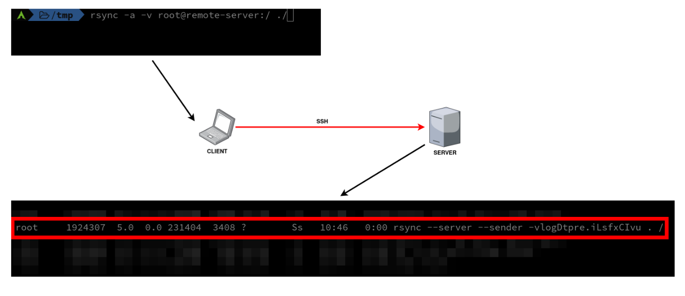
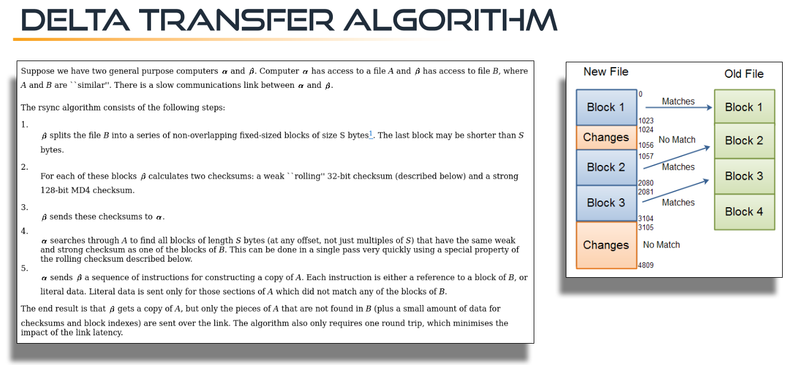
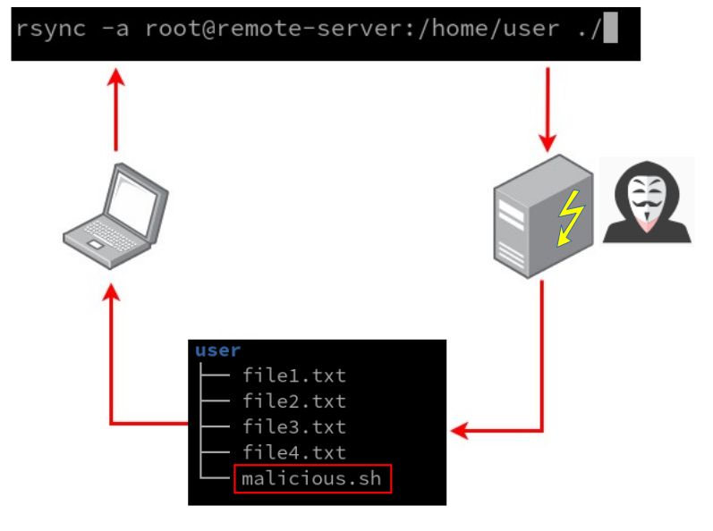
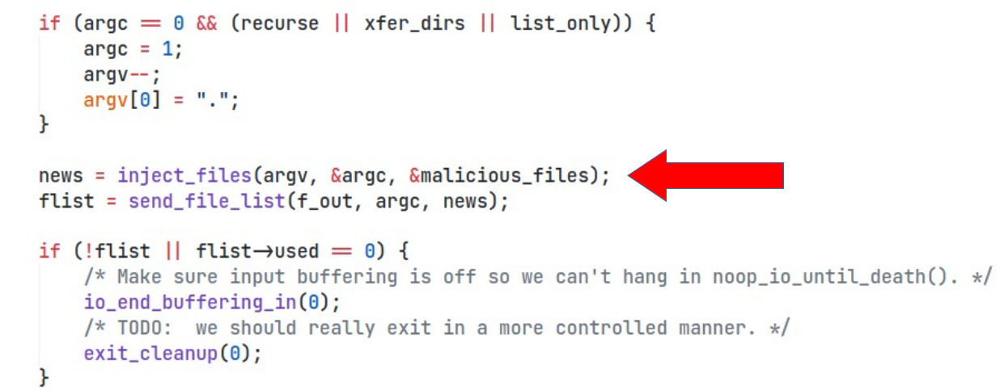

+++
date = '2022-06-30T14:20:34+02:00'
draft = false
title = 'Weaponizing Rsync 0Day Vulnerability'
cover = 'cover.jpg'
categories = ['0-day', 'vulnerability', 'exploitation']
+++


The rsync utility has been a cornerstone of file transfer and synchronization for over 25 years. It's a fundamental tool, relied upon by countless other applications, and even frequently used by ransomware operators for data exfiltration due to its efficiency. This widespread adoption, however, also makes it a prime target for security researchers looking for vulnerabilities. Recently, we have discovered a zero-day vulnerability in rsync, and it has significant implications for anyone using the tool.

## Understanding rsync's Inner Workings

To grasp the nature of this vulnerability, it's helpful to understand how rsync operates. When you initiate a file copy, say from a remote server to your local machine, rsync establishes an SSH connection. On the remote server, a new rsync process spins up, executing with special internal parameters. 



This server-side rsync then crawls the specified target directory to create a "file transfer list." This list is comprehensive, containing details like absolute paths, sizes, permissions, modification dates, and even checksums of the files to be transferred.

```c 

// https://github.com/RsyncProject/rsync/blob/9994933c8ccf7ead27c81fe4ce2eb4e08af20c7f/main.c#L950
if (argc == 0 && (recurse || xfer_dirs || list_only)) {
    argc = 1;
    argv--;
    argv[0] = ".";
}

flist = send_file_list(f_out,argc,argv); if (!flist || flist->used == 0) {
    /* Make sure input buffering is off so we can't hang in noop_io_until_death(). */
    io_end_buffering_in(0);
    /* TODO:  we should really exit in a more controlled manner. */
    exit_cleanup(0);
}

io_start_buffering_in(f_in);

send_files(f_in, f_out);
io_flush(FULL_FLUSH);
handle_stats(f_out);
if (protocol_version >= 24)
    read_final_goodbye(f_in, f_out);
io_flush(FULL_FLUSH);
exit_cleanup(0);

```

Once this list is generated, the server sends it to the client. The client then begins fetching files one by one. For efficiency, especially when synchronizing existing files, rsync employs a sophisticated "Delta Transfer Algorithm." This algorithm calculates the differences between files and only transmits the changed "blocks" over the network, significantly speeding up transfers. However, for brand new files, the entire content is still sent.




## The Fundamental Problem: Blind Trust in File Lists

The core of the vulnerability lies in a fundamental design aspect of rsync (and many other file transfer applications): **the client has no inherent way of knowing how many files to expect from the remote server.** If the remote host is compromised by an attacker, they can simply send additional, unwanted files as part of the transfer list.



While this in itself isn't a vulnerability, the problem arises if the file transfer application fails to adequately handle these unexpected files. In the case of rsync, this vulnerability can be leveraged to inject malicious files and overwrite critical files on the client side, potentially leading to **code execution**. This attack vector isn't entirely new. [Similar vulnerabilities (CVE-2019-6110/CVE-2019-6111)](https://www.youtube.com/watch?v=Yv6mD5vOVI0) have been found in other file transfer utilities, like SCP, where attackers exploited the ability to overwrite specific client-side files. The goal is to manipulate files that, if compromised, can grant an attacker unauthorized access or the ability to execute arbitrary commands. These can include:

* `/etc/passwd` or `/etc/shadow` (for adding new users)
* SSH keys (for gaining persistent access)
* User-specific configuration files like `.bashrc`, `.zshrc`, `.profile`, `.aliases`, or `.gitconfig` (which can be used to execute commands when the user logs in or interacts with Git).

## Bypassing Sanity Checks: The Path to Code Execution

Since we knew exactly what we were looking for, we directly started analyzing the functions which are responsible for creating the file transfer list. Our goal was to inject malicious file entries into this list.

While rsync does have a `sanitize_path` function designed to prevent writing files to arbitrary locations outside the intended destination directory (e.g., using `../` to escape), this mitigation has a crucial limitation. It only prevents writing *above* the destination directory. 

```c
// https://github.com/RsyncProject/rsync/blob/0ac7ebceef70417355f25daf9e2fd94e84c49749/util1.c#L1014

/* Make path appear as if a chroot had occurred.  This handles a leading
 * "/" (either removing it or expanding it) and any leading or embedded
 * ".." components that attempt to escape past the module's top dir.
 *
 * If dest is NULL, a buffer is allocated to hold the result.  It is legal
 * to call with the dest and the path (p) pointing to the same buffer, but
 * rootdir will be ignored to avoid expansion of the string.
 *
 * The rootdir string contains a value to use in place of a leading slash.
 * Specify NULL to get the default of "module_dir".
 *
 * The depth var is a count of how many '..'s to allow at the start of the
 * path.
 *
 * We also clean the path in a manner similar to clean_fname() but with a
 * few differences:
 *
 * Turns multiple adjacent slashes into a single slash, gets rid of "." dir
 * elements (INCLUDING a trailing dot dir), PRESERVES a trailing slash, and
 * ALWAYS collapses ".." elements (except for those at the start of the
 * string up to "depth" deep).  If the resulting name would be empty,
 * change it into a ".". */
char *sanitize_path(char *dest, const char *p, const char *rootdir, int depth, int flags)
{
	char *start, *sanp;
	int rlen = 0, drop_dot_dirs = !relative_paths || !(flags & SP_KEEP_DOT_DIRS);

	if (dest != p) {
		int plen = strlen(p); /* the path len INCLUDING any separating slash */
		if (*p == '/') {
			if (!rootdir)
				rootdir = module_dir;
			rlen = strlen(rootdir);
			depth = 0;
			p++;
		}
		if (!dest)
			dest = new_array(char, MAX(rlen + plen + 1, 2));
		else if (rlen + plen + 1 >= MAXPATHLEN)
			return NULL;
		if (rlen) { /* only true if p previously started with a slash */
			memcpy(dest, rootdir, rlen);
			if (rlen > 1) /* a rootdir of len 1 is "/", so this avoids a 2nd slash */
				dest[rlen++] = '/';
		}
	}

	if (drop_dot_dirs) {
		while (*p == '.' && p[1] == '/')
			p += 2;
	}

	start = sanp = dest + rlen;
	/* This loop iterates once per filename component in p, pointing at
	 * the start of the name (past any prior slash) for each iteration. */
	while (*p) {
		/* discard leading or extra slashes */
		if (*p == '/') {
			p++;
			continue;
		}
		if (drop_dot_dirs) {
			if (*p == '.' && (p[1] == '/' || p[1] == '\0')) {
				/* skip "." component */
				p++;
				continue;
			}
		}
		if (*p == '.' && p[1] == '.' && (p[2] == '/' || p[2] == '\0')) {
			/* ".." component followed by slash or end */
			if (depth <= 0 || sanp != start) {
				p += 2;
				if (sanp != start) {
					/* back up sanp one level */
					--sanp; /* now pointing at slash */
					while (sanp > start && sanp[-1] != '/')
						sanp--;
				}
				continue;
			}
			/* allow depth levels of .. at the beginning */
			depth--;
			/* move the virtual beginning to leave the .. alone */
			start = sanp + 3;
		}
		/* copy one component through next slash */
		while (*p && (*sanp++ = *p++) != '/') {}
	}
	if (sanp == dest) {
		/* ended up with nothing, so put in "." component */
		*sanp++ = '.';
	}
	*sanp = '\0';

	return dest;
}
```
However, rsync *does* allow overwriting any file *within* or *under* the specified destination directory.



This means if a user is copying a file, say `backup.tar.gzip`, to their home directory, a malicious rsync server could inject a modified `.bashrc` or `.profile` file within that same home directory. When the user subsequently opens a new terminal session, the malicious code within the overwritten `.bashrc` would be executed, granting the attacker code execution on the client machine. A Proof of Concept (POC) for this attack has been successfully created.


## Exploitation Conditions and Mitigations

Exploiting this vulnerability requires certain conditions:

1.  **Attacker Control of the Server:** The attacker needs to have control over the server hosting the files that the victim is trying to copy.
2.  **Client Connection to Malicious Host:** Alternatively, the attacker could trick the client into connecting to their malicious host. This could be achieved through man-in-the-middle attacks, especially if the attacker is on the same network as the victim.

It's important to note that if a man-in-the-middle attack forces a client to connect to an unknown host, the client will likely see a warning about the remote host identification changing due to differing public keys. However, if the client is connecting for the first time, or if they habitually ignore such warnings, the attack can proceed.

Another interesting attack vector involves Git repositories. If a user is copying files into a Git directory, an attacker could inject malicious Git hooks (like `pre-commit` or `post-commit` hooks), which would then execute when certain Git operations are performed.

## What Can Be Done?

This rsync zero-day highlights a fundamental challenge in file transfer applications. While there isn't a simple, universal fix that accounts for all scenarios, users can take some precautions:

* **Be Vigilant About Sources:** Always be careful about where you are copying files from. Only copy files from trusted sources.
* **Monitor for Unexpected Files:** When copying a single file or a known directory structure, you should have a clear expectation of what will be transferred. If additional, unexpected files appear, it's a strong indicator of compromise. For example, if you're copying `/etc/passwd`, you expect only one new entry. If you're copying `/etc/`, you expect an `/etc/` directory. If anything additional shows up, investigate immediately.
* **Beware of Trailing Slashes:** When copying a directory, if you include a trailing slash in the remote path (e.g., `rsync remote:/etc/ local/`), the client has no way of knowing the exact contents of the `/etc/` directory. This makes it much harder to detect injected files. Omitting the trailing slash (e.g., `rsync remote:/etc local/`) might offer a slightly clearer expectation of a single directory being copied.

**Stay safe online, and always exercise caution when transferring files, especially from unknown or untrusted sources.**

## Links
- [HackInParis 2022 - Weaponizing Rsync 0Day Vulnerability](https://youtu.be/XwA5QBbGpQA)
- https://github.com/RsyncProject/rsync/commit/b7231c7d02cfb65d291af74ff66e7d8c507ee871
- https://www.openwall.com/lists/oss-security/2022/08/02/1
- https://nvd.nist.gov/vuln/detail/cve-2022-29154
- https://www.youtube.com/watch?v=Yv6mD5vOVI0
